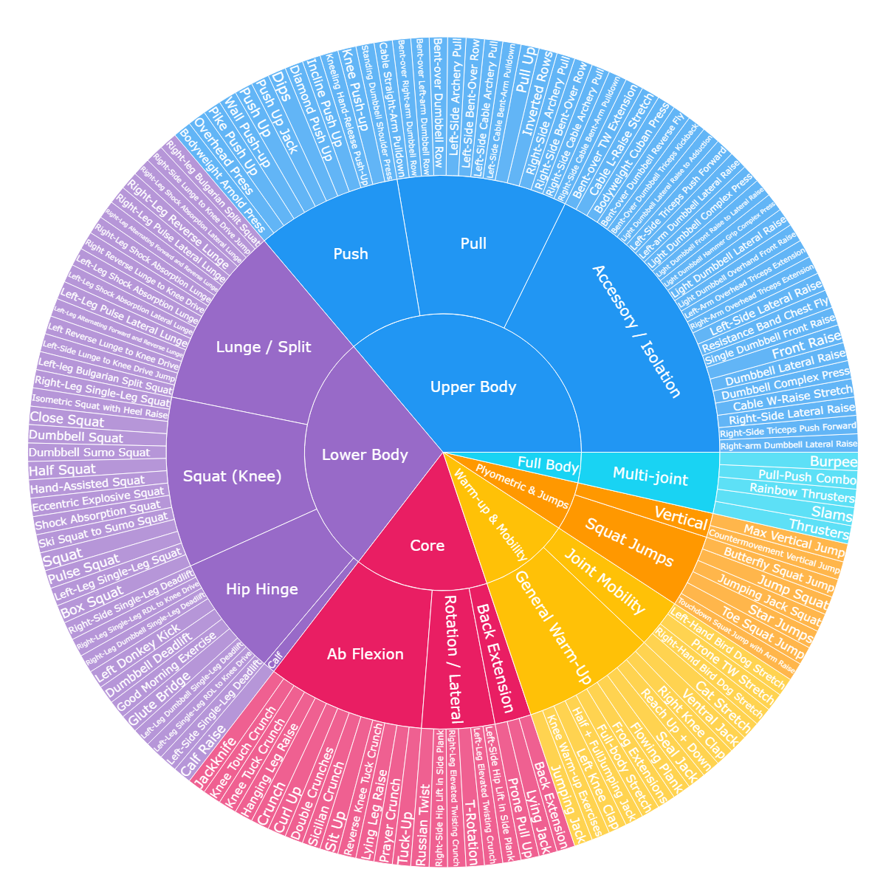

# PAAE
## Rep-Fitness Dataset

We propose a clear, human-centric repetitive fitness action test dataset, **Rep-Fitness**. The videos are sourced from YouTube and Keep fitness platforms, and the dataset contains 141 action categories. You can access the Rep-Fitness Dataset from Google Drive via the following link:

[Rep-Fitness Dataset](https://drive.google.com/file/d/1GFPxQo5e5eQUy4h6_6-1K-rsZbKxF1Gq/view?usp=drive_link).(*For educational and research purposes only.*)

Click the link above to open the dataset on Google Drive.

